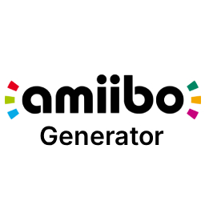

# AmiiboGenerator

Generates all (or a selection of) Amiibos directly on your Nintendo Switch.

### Features:

- Interactive CLI menu system
- Generate any Amiibo
  - Does not override existing Amiibos
  - Toggle to download Amiibo images
  - Built-in compression of Images to save space
- Delete any Amiibo
- Manually update the database anytime
- Integrates nicely with Emuiibo

### Note:

It needs internet to download the amiibo database from [here](https://www.amiiboapi.com/api/amiibo/), though you can download it manually and place it in `sdmc:/emuiibo/amiibos.json`, which skips the check.

The homebrew does not generate amiibo.bin dumps and does not contain anything stolen from nintendo.
It only generates json files that emuiibo can use. They are exactly the same ones than the ones generated by emuiigen.

Downloading amiibos with images will take a while. The tool automatically resizes them for space & speed and converts RGB to RGBA if necessary.

### Credits:

- Slluxx - Original idea & codebase
- AmiiboAPI - Amiibo database
- nothings/stb - Image loading, writing & resizing
- nlohmann/json - JSON parsing
